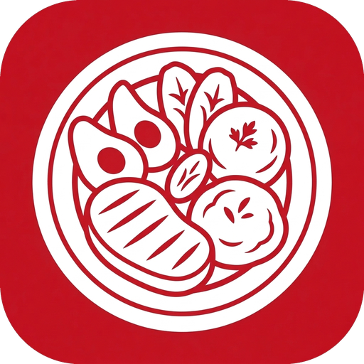

<div align="center">

  

  # 🥗 Food Tracker
  ### *Tu Asistente Nutricional Inteligente, 100% Local-First y con Visión IA*

  <p align="center">
    <strong>Privacidad Absoluta • Sin Suscripciones • Modelo BYOK • Metabolismo Clínico de Mifflin-St Jeor</strong>
  </p>

  <p align="center">
    <a href="https://flutter.dev"></a>
    <a href="https://dart.dev"></a>
    <a href="https://sqlite.org"></a>
    <a href="https://ai.google.dev"></a>
    <a href="https://github.com/VICTOREB13/App-Food-Tracker/actions"></a>
    <a href="LICENSE"></a>
  </p>

</div>

---

## 🌟 ¿Qué es Food Tracker?

**Food Tracker** es una aplicación móvil moderna de control y seguimiento nutricional diseñada para quienes desean registrar sus comidas caseras o de restaurante **sin necesidad de báscula de cocina**. 

A diferencia de las aplicaciones comerciales tradicionales que cobran suscripciones mensuales y envían tus fotos e información privada a servidores remotos de terceros, **Food Tracker opera bajo una estricta filosofía 100% Local-First y BYOK (Bring Your Own Key)**:

- 🔒 **Tus datos nunca salen de tu teléfono:** Tu base de datos SQLite, tu historial de pesajes, tus fotos y tus notas permanecen en el almacenamiento de tu propio dispositivo.
- 💸 **Cero suscripciones:** Utilizas el modelo gratuito de inteligencia artificial de Google con tu propia clave de API gratuita.
- ⚡ **Velocidad instantánea y modo offline:** La app arranca en 0 ms y te permite registrar comidas rápidas, consultar tu despensa y revisar tus macros incluso sin conexión a internet.

---

## ✨ Características Principales

### 📸 1. Inferencia Nutricional con Visión Multimodal (Gemini AI)
- **Estimación Visual sin Báscula:** Toma o sube una foto de tu plato. Gemini analiza la volumetría de los alimentos aplicando reglas clínicas anatómicas (puño ~ 1 taza de almidón, palma ~ 100-130g de proteína, falange ~ 10-15g de grasas y deducción de grasa oculta de cocción).
- **Desglose Automático de Ingredientes:** La IA identifica y lista cada alimento por separado con su respectiva porción, calorías y macronutrientes.
- **Re-análisis Inteligente con Corrección de Usuario:** ¿La IA detectó carne molida pero en realidad comiste carne mechada? Edita el ingrediente y pulsa **"Re-analizar con IA"**; el modelo re-evaluará la foto incorporando tus aclaraciones para un cálculo exacto.

### 🔬 2. Motor Clínico Mifflin-St Jeor y Master Prompt Dinámico
- **Cálculo Metabólico Exacto:** Obtén tu Tasa Metabólica Basal (**BMR**) y Gasto Energético Total Diario (**TDEE**) según tu género biológico, peso, estatura, edad, nivel de actividad física y pasos diarios estimados.
- **Metas Adaptadas a tu Objetivo:** Ajuste calórico automático para *Pérdida de Grasa* (déficit de -500 kcal), *Mantenimiento Normocalórico* o *Ganancia Muscular* (superávit de +300 kcal).
- **Master Prompt Personalizado:** La app genera y envía un resumen de tu perfil biológico a Gemini en cada foto para que las estimaciones se adapten a tu contexto individual.
- **Sincronización Bidireccional Total:** Cambiar tus metas en Ajustes actualiza tu Resumen Metabólico al instante, y actualizar tu peso o biometría recalcula tus metas automáticamente en toda la app.

### 🚀 3. Flujo de Inicio y Onboarding de Primer Uso
- **Asistente Guiado en 4 Pasos:** Al abrir la app por primera vez, un asistente personalizado te acompaña a configurar tu nombre, biometría, hábitos de actividad y objetivo corporal con una vista previa de tu plan metabólico en tiempo real.
- **Enrutamiento Inteligente:** Una vez completado, la app te lleva directamente al Dashboard y guarda tu preferencia en hardware seguro para no volver a interrumpirte.

### 🔎 4. Inspección de Comida en Pantalla Completa
- ¿Quieres ver los detalles de una comida pasada? Accede al **Visor Full-Screen** interactivo con soporte táctil de zoom y desplazamiento (*pan & pinch-to-zoom* de 0.5x a 5.0x).

### 🏷️ 5. Nomenclatura Dinámica y Organización de Galería
- Las fotos se guardan en el directorio público `Pictures/FoodTrackerMeals` con la nomenclatura estandarizada:
  ```text
  YYYY_MM_DD_{TIPO}_{INDICE}.jpg
  (Ejemplo: 2026_09_10_B_01.jpg para Breakfast / Desayuno)
  ```
- Si cambias la comida de Almuerzo a Desayuno o Snack, la app **renombra el archivo físico en disco y actualiza la base de datos automáticamente**.

### 📊 6. Panel de Analíticas y Gráficas a 60 FPS
- Gráfico interactivo de tendencia de peso acelerado por hardware con curvas Bézier suaves.
- Bento Grid de cumplimiento calórico, rachas de registro y distribución porcentual de macronutrientes.
- Filtro por rangos: 7 días, 30 días, 90 días o **Histórico completo**.

---

## 🔑 Guía Paso a Paso: Cómo Obtener tus API Keys 100% Gratis

Para habilitar el análisis de fotos con IA y la búsqueda de productos envasados, la app utiliza el modelo **BYOK (Bring Your Own Key)**. Ambas claves son **completamente gratuitas y no requieren tarjeta de crédito**.

```
┌──────────────────────────────────────────────────────────────────────────────────┐
│  💡 ¿POR QUÉ BYOK?                                                               │
│  Porque eres el único dueño de tu información. Nadie puede cobrarte una cuota    │
│  mensual por usar un servicio que los proveedores oficiales ofrecen gratis.       │
└──────────────────────────────────────────────────────────────────────────────────┘
```

---

### Opción A: Google Gemini API Key *(Esencial para Visión IA)*

La clave de Gemini permite a la app analizar tus fotografías de comida utilizando **Gemini 2.5 Flash** (rápido y ultra-eficiente) o **Gemini Pro** (razonamiento clínico profundo).

1. **Ingresa a Google AI Studio:**
   - Ve al portal oficial: **[https://aistudio.google.com/](https://aistudio.google.com/)** (o [https://ai.google.dev/](https://ai.google.dev/)).
2. **Inicia sesión con tu cuenta de Google:**
   - Usa cualquier cuenta de Google (Gmail personal o corporativa).
3. **Crea tu clave de API:**
   - En la esquina superior izquierda o en la barra principal, haz clic en el botón azul **`Get API key`** (o *"Obtener clave de API"*).
   - Haz clic en **`Create API key`** (o *"Crear clave de API en un nuevo proyecto"*).
4. **Copia tu Clave:**
   - Aparecerá una ventana con tu clave de texto (comienza con las letras `AIzaSy...`). Haz clic en el botón **Copiar**.
5. **Pégala en Food Tracker:**
   - Abre la app, ve a **Ajustes ⚙️** -> sección **Google Gemini API Key**.
   - Pega tu clave en el campo de texto y pulsa **Guardar Clave**.
   - ¡Listo! Tu clave quedará custodiada en el hardware cifrado de tu dispositivo (`EncryptedSharedPreferences`).

> [!TIP]
> **¿Tiene algún costo?**
> **No.** El nivel gratuito (*Free Tier*) de Google AI Studio incluye **hasta 15 solicitudes por minuto (RPM)** y **1,500 solicitudes por día (RPD)**. Para registrar 4 o 5 comidas al día, nunca consumirás más del 1% de tu cuota gratuita diaria.

---

### Opción B: USDA FoodData Central API Key *(Opcional para Códigos de Barra)*

Esta clave te permite consultar la base de datos nutricional del Departamento de Agricultura de EE.UU. para escanear productos comerciales envasados. Si no la configuras, la app utilizará automáticamente el catálogo público de **Open Food Facts** como respaldo.

1. **Ingresa al registro de desarrolladores de USDA:**
   - Ve a: **[https://fdc.nal.usda.gov/api-key-signup.html](https://fdc.nal.usda.gov/api-key-signup.html)** (o [https://api.data.gov/signup/](https://api.data.gov/signup/)).
2. **Completa el formulario gratuito:**
   - Ingresa tu Nombre, Apellido y Correo electrónico.
3. **Genera la Clave:**
   - Haz clic en **`Sign Up`**. Tu clave de API se mostrará de inmediato en pantalla y se enviará una copia a tu correo electrónico.
4. **Pégala en Food Tracker:**
   - En la app, ve a **Ajustes ⚙️** -> tarjeta **USDA FoodData Central API Key**.
   - Pega tu clave y pulsa **Guardar Clave**.

> [!NOTE]
> La API de USDA ofrece **hasta 1,000 consultas por hora**, lo que cubre con creces cualquier necesidad doméstica o deportiva.

---

## 🎨 Sistema de Diseño Victor Engineer

La aplicación implementa un lenguaje visual refinado basado en Bento Grids, alto contraste y tipografía suiza:

| Token | Modo Oscuro (*Obsidian Zinc*) | Modo Claro (*Crisp Zinc*) | Propósito |
| :--- | :---: | :---: | :--- |
| **Fondo Principal** | `#09090B` | `#FAFAFA` | Superficie base de la aplicación |
| **Tarjetas Bento** | `#121215` | `#FFFFFF` | Contenedores modulares squircle (20px) |
| **Bordes Estructurales** | `#27272A` | `#E4E4E7` | Delimitadores visuales sutiles |
| **Carmesí Primario** | `#DC2626` / `#C31723` | `#DC2626` / `#C31723` | Botones de acción, acentos y marca |
| **Texto Primario** | `#FAFAFA` | `#09090B` | Lectura de alta legibilidad |

### Semántica de Macronutrientes
- 🔥 **Calorías:** `#F97316` (Naranja fuego)
- 🥩 **Proteínas:** `#EF4444` (Rojo cárnico)
- 🌾 **Carbohidratos:** `#EAB308` (Ámbar cereal)
- 🥑 **Grasas:** `#3B82F6` (Azul lípido)
- 💧 **Hidratación:** `#06B6D4` (Cian hidratación)

---

## 🏗️ Arquitectura Técnica y Estándares de Código

El proyecto se rige por directrices de ingeniería de producción diseñadas para garantizar mantenibilidad, testabilidad y rendimiento:

```
lib/
├── controllers/          # Controladores reactivos (ChangeNotifier / Singleton)
│   ├── meal_controller.dart
│   └── settings_controller.dart
├── models/               # Modelos inmutables con Patrón Sentinel y ModelSanitizer
│   ├── daily_goals.dart
│   ├── food_item.dart
│   ├── meal.dart
│   ├── user_profile.dart
│   └── weight_log.dart
├── screens/              # Orquestadores puros (< 300 LoC estrictas por archivo)
│   ├── dashboard_screen.dart
│   ├── meal_detail_screen.dart
│   ├── metrics_screen.dart
│   ├── onboarding_screen.dart
│   ├── settings_screen.dart
│   └── user_profile_screen.dart
├── services/             # Servicios nucleares desacoplados
│   ├── backup_service.dart          # Exportación/importación JSON atómica
│   ├── database_service.dart        # SQLite con modo WAL y B-Tree composite indexes
│   ├── gemini_vision_service.dart   # Inferencia visual multimodal y schemas JSON
│   ├── image_processing_service.dart# Compresión y renombrado inteligente
│   ├── metabolic_calculator.dart    # Motor clínico Mifflin-St Jeor
│   └── secure_storage_service.dart  # Custodia en hardware cifrado
└── widgets/              # Componentes visuales atómicos reutilizables
    ├── common/           # App bars, diálogos, VeLogo, chips
    ├── dashboard/        # Bento cards del dashboard, FAB menú
    ├── meal_detail/      # Visor full-screen, lista de items, re-análisis IA
    ├── metrics/          # Painter vectorial Bézier y Bento de peso
    ├── onboarding/       # Pasos modulares del wizard de bienvenida
    ├── profile/          # Bento de biometría, actividad y Master Prompt
    └── settings/         # Selectores de modelos, depuración de fotos, backup
```

### Reglas de Oro Implementadas:
1. **Límite Modular Estricto:** Ninguna pantalla o widget sobrepasa las **300 líneas de código**.
2. **Patrón Sentinel en Modelos:** Inmutabilidad garantizada donde pasar `null` explícito en `copyWith` desvincula campos opcionales sin ambigüedad.
3. **Persistencia Criptográfica en Hardware:** Custodia mediante `EncryptedSharedPreferences` en Android y Keychain en iOS.
4. **Firma Permanente de Releases:** Clave criptográfica inmutable (`release.keystore`) vinculada en CI/CD que permite actualizar la app sin desinstalar ni perder datos.

---

## 📲 Descarga e Instalación

### Opción 1: Descargar el APK Oficial (Android)
Puedes descargar la versión lista para usar desde la sección de lanzamientos:
👉 **[Descargar Último Release Oficial en GitHub Releases](https://github.com/VICTOREB13/App-Food-Tracker/releases)**

### Opción 2: Compilación Local desde el Código Fuente

Si deseas compilar la aplicación por tu cuenta:

```bash
# 1. Clonar el repositorio
git clone https://github.com/VICTOREB13/App-Food-Tracker.git
cd App-Food-Tracker

# 2. Instalar dependencias de Flutter
flutter pub get

# 3. Ejecutar la suite completa de pruebas (307 pruebas)
flutter test

# 4. Compilar o ejecutar en tu dispositivo Android
flutter run
```

---

## 🛡️ Seguridad y Privacidad

- **Cero Telemetría Oculta:** La aplicación no incluye trackers de analíticas (Google Analytics, Mixpanel, Firebase, etc.).
- **Almacenamiento Local Aislado:** Tu historial alimenticio se almacena localmente y puede exportarse como un archivo JSON cifrado o plano cuando desees respaldarlo.
- **Conexión Directa:** Las imágenes enviadas para análisis viajan directamente desde tu teléfono hacia los servidores oficiales de Google Generative AI mediante HTTPS seguro, sin servidores proxy intermediarios.

---

## 📄 Licencia

Este proyecto está bajo la Licencia **MIT**. Eres libre de usarlo, estudiarlo, modificarlo y distribuirlo conforme a los términos de la licencia.

---

<div align="center">
  Diseñado y desarrollado con pasión por <strong>Victor Engineer (VE)</strong>.<br />
  <sub>Comidas reales, métricas exactas y privacidad inquebrantable.</sub>
</div>
