# 🏗️ Arquitectura del Sistema: Victor Engineer - Food Tracker (v0.2.0-alpha)

> **Mesa de Control & Backend-Architect:** Este documento establece los componentes fundamentales, el Tech Stack tecnológico, las decisiones arquitectónicas estructurales y el flujo de datos integral de la aplicación **Victor Engineer - Food Tracker**.

---

## 🛠️ 1. Tech Stack Oficial

- **Framework Móvil / Desktop:** Flutter 3.22+ / 3.27+ (Dart SDK `>=3.4.0 <4.0.0`).
- **Base de Datos Primaria (Local-First):** SQLite v2 mediante `sqflite` (móvil) y `sqflite_common_ffi` (escritorio/tests), configurado con:
  - `PRAGMA journal_mode = WAL;` (Concurrencia óptima de lecturas y escrituras simultáneas).
  - `PRAGMA synchronous = NORMAL;` (Persistencia confiable y latencia < 16 ms).
  - `PRAGMA foreign_keys = ON;` (Integridad referencial estricta).
  - Tablas: `meals`, `pantry_items`, `weight_logs`.
- **Motor de Inferencia de Visión & Descubrimiento Dinámico:** Google Generative AI SDK (`google_generative_ai: ^0.4.6`) con consulta en vivo a `GET https://generativelanguage.googleapis.com/v1beta/models?key={API_KEY}` para introspección y selección de modelos multimodales reales (`gemini-2.5-flash`, `gemini-1.5-pro`, etc.), generación estructurada JSON (`responseSchema`) y temperatura baja (`0.2`).
- **Bases de Datos Nutricionales (Cascada Híbrida):**
  - **Primaria:** USDA FoodData Central API (`https://api.nal.usda.gov/fdc/v1/`) con normalización energética ($kJ \rightarrow kcal$ factor 4.184) y control de tasa (1.000 req/hr).
  - **Fallback:** Open Food Facts API v2 con timeout defensivo de 10s.
- **Motor Biométrico & Metabólico:** `MetabolicCalculator` implementando la ecuación clínica internacional **Mifflin-St Jeor** para TMB y TDEE según pasos diarios y actividad física, generando el Master Prompt contextual inyectado en la visión IA.
- **Seguridad Criptográfica & BYOK:** `flutter_secure_storage` con `AndroidOptions(encryptedSharedPreferences: true)` en Android y Keychain en iOS para custodia local de las claves de API de Gemini y USDA.
- **Motor Gráfico de Métricas:** `WeightLineChartPainter` con curvas de Bézier suavizadas, gradientes cónicos y renderizado a **60 FPS** acelerado por hardware.
- **Procesamiento y Compresión de Imágenes:** Paquete `image: ^4.5.2` con redimensionamiento defensivo a un límite máximo de 1024x1024 píxeles y codificación JPEG al 85% de calidad previa al envío al modelo de visión.
- **Persistencia de Preferencias de UI:** `shared_preferences: ^2.3.5` para el modo de tema y perfil.
- **Sistema de Diseño & Tipografía:** `google_fonts: ^6.2.1` (`Outfit` para métricas display y títulos, `Inter` para cuerpos y datos secundarios).

---

## 📐 2. Diagrama Arquitectónico de Capas (Mermaid)

```mermaid
graph TD
    subgraph UI_Layer [Capa de Presentación - Monolito Modular < 300 LoC]
        DS[DashboardScreen - 294 LoC]
        MDS[MealDetailScreen - 287 LoC]
        SS[SettingsScreen - 262 LoC]
        UPS[UserProfileScreen - 238 LoC]
        MSCR[MetricsScreen - 198 LoC]
        CHR[CaloriesHeroRing]
        MBC[MacroBentoCard]
        DFM[DashboardFabMenu]
        WCS[WeekCalendarStrip]
        WLCP[WeightLineChartPainter - 60 FPS]
        GMSC[GeminiModelSelectorCard]
        UAKC[UsdaApiKeyCard]
    end

    subgraph State_Controllers [Capa de Controladores de Estado]
        MC[MealController - ChangeNotifier]
        SC[SettingsController - ChangeNotifier]
        TM[ThemeManager - ChangeNotifier]
    end

    subgraph Service_Layer [Capa de Servicios de Dominio]
        DBS[DatabaseService - SQLite WAL v2]
        GVS[GeminiVisionService - Vision AI]
        GMS[GeminiModelService - Dynamic API]
        USDS[UsdaFoodDataService - USDA FDC]
        BLS[BarcodeLookupService - Cascada]
        OFFS[OpenFoodFactsService - Barcodes]
        MCALC[MetabolicCalculator - Mifflin-St Jeor]
        SSS[SecureStorageService - Encriptado]
        BKS[BackupService - Export/Import v2]
        IPS[ImageProcessingService - Resize 1024px]
    end

    subgraph Domain_Models [Modelos Inmutables con Sentinel & Sanitizer]
        ML[Meal]
        FI[FoodItem]
        PI[PantryItem]
        DG[DailyGoals]
        UP[UserProfile]
        WL[WeightLog]
        GMI[GeminiModelInfo]
        UFI[UsdaFoodItem]
        MSAN[ModelSanitizer - Defensive Clamp/Truncate]
    end

    subgraph Storage_Layer [Persistencia Local de Baja Latencia]
        DB[(SQLite app_food_tracker.db v2)]
        FS[(Sistema de Archivos - meals/*.jpg)]
        SEC[(EncryptedSharedPreferences / Keychain)]
        SP[(SharedPreferences - UI Theme)]
    end

    subgraph External_APIs [Servicios Cloud Externos - BYOK]
        GEMINI[Google Gemini Dynamic API]
        USDA[USDA FoodData Central API]
        OFF[Open Food Facts API v2]
    end

    %% Relaciones UI -> Controllers
    DS --> MC
    MDS --> MC
    SS --> SC
    UPS --> SC
    MSCR --> MC
    DS --> TM

    %% Relaciones Controllers -> Services
    MC --> DBS
    MC --> SSS
    MC --> IPS
    SC --> SSS
    SC --> DBS
    SC --> BKS
    SC --> GMS
    SC --> USDS
    SC --> MCALC

    %% Relaciones Cascada & IA
    BLS --> USDS
    BLS --> OFFS
    GVS --> GEMINI
    GMS --> GEMINI
    USDS --> USDA
    OFFS --> OFF
    GVS --> MCALC

    %% Relaciones Services -> Models
    DBS --> Domain_Models
    GVS --> Domain_Models
    USDS --> Domain_Models
    BKS --> Domain_Models

    %% Relaciones Services -> Storage
    DBS --> DB
    SSS --> SEC
    IPS --> FS
    TM --> SP
```



---

## 🏛️ 3. Principios y Decisiones Clave de Diseño

### 3.1. Local-First & Cero Dependencia de Red para Operaciones Básicas
- Todas las operaciones CRUD de comidas, despensa, metas calóricas, registros de peso e historial son ejecutadas de manera síncrona/inmediata en SQLite local.
- La red únicamente se invoca bajo demanda explícita: al fotografiar un plato para estimación visual con Gemini, consultar modelos en vivo o escanear un código de barras. La pérdida de conectividad no interrumpe ninguna función de visualización o registro.

### 3.2. Concurrencia y Resiliencia en SQLite v2 (Modo WAL)
- Se activa `PRAGMA journal_mode = WAL;` y `PRAGMA synchronous = NORMAL;`.
- Permite que múltiples llamadas asíncronas lean datos concurrentemente sin bloqueos de escritura.
- La migración a la versión 2 crea la tabla `weight_logs` y el índice `idx_weight_logs_date` de forma segura dentro de transacciones.
- Bloqueo de inicialización mediante `_initFuture` en el singleton `DatabaseService` contra arranques en frío simultáneos.

### 3.3. Inmutabilidad y Patrón Sentinel
- Los modelos (`Meal`, `FoodItem`, `PantryItem`, `DailyGoals`, `UserProfile`, `WeightLog`, `GeminiModelInfo`) son inmutables.
- Para distinguir entre "no actualizar un campo" y "limpiar un campo asignándole `null`", el método `copyWith` utiliza una instancia privada centinela:
  ```dart
  static const Object _sentinel = Object();
  Meal copyWith({Object? imagePath = _sentinel, ...}) {
    return Meal(
      imagePath: identical(imagePath, _sentinel) ? this.imagePath : (imagePath as String?),
      ...
    );
  }
  ```

### 3.4. Sanitización Defensiva Centralizada (`ModelSanitizer`)
- Protección contra strings gigantescos (nombres acotados a 255 caracteres, notas a 2000 caracteres, JSON a 100000 caracteres).
- Valores numéricos acotados contra `NaN`, infinitos y límites plausibles (`clampDouble(val, min: 0.0, max: 9999.0)`).
- Fechas deserializadas con fallback a `DateTime.now()` en caso de formatos corruptos.

### 3.5. Monolito Modular (< 300 LoC por Pantalla)
- Ninguna pantalla o widget en `lib/` excede las 300 líneas de código:
  - `DashboardScreen`: 294 LoC
  - `MealDetailScreen`: 287 LoC
  - `MetricsScreen`: 198 LoC
  - `SettingsScreen`: 262 LoC
  - `UserProfileScreen`: 238 LoC
- Se extraen tarjetas, diálogos, barras y gráficos en widgets especializados (`widgets/common/`, `widgets/dashboard/`, `widgets/meal_detail/`, `widgets/settings/`, `widgets/profile/`, `widgets/metrics/`).

### 3.6. Seguridad Criptográfica y Firma Permanente de Producción
- Claves de Gemini y USDA almacenadas mediante `FlutterSecureStorage` en `EncryptedSharedPreferences` (Android) y Keychain (iOS).
- Clave Keystore permanente RSA 2048 con alias `foodtracker` y validez hasta 2056 inyectada en CI/CD mediante secretos de GitHub.

