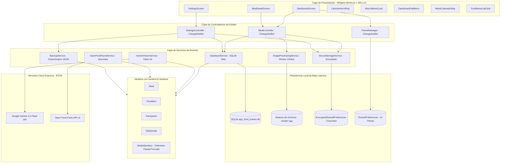

# 🏗️ Arquitectura del Sistema: Victor Engineer - Food Tracker (v1.0.0)

> **Mesa de Control & Backend-Architect:** Este documento establece los componentes fundamentales, el Tech Stack tecnológico, las decisiones arquitectónicas estructurales y el flujo de datos integral de la aplicación **Victor Engineer Food Tracker**.

---

## 🛠️ 1. Tech Stack Oficial

- **Framework Móvil / Desktop:** Flutter 3.22+ (Dart SDK `>=3.2.0 <4.0.0`).
- **Base de Datos Primaria (Local-First):** SQLite mediante `sqflite` (móvil) y `sqflite_common_ffi` (escritorio/tests), configurado con:
  - `PRAGMA journal_mode = WAL;` (Concurrencia óptima de lecturas y escrituras simultáneas).
  - `PRAGMA synchronous = NORMAL;` (Persistencia confiable y latencia < 16 ms).
  - `PRAGMA foreign_keys = ON;` (Integridad referencial estricta).
- **Motor de Inferencia de Visión:** Google Generative AI SDK (`google_generative_ai: ^0.4.6`) con modelo **Gemini 2.5 Flash**, generación estructurada JSON (`responseSchema` y `responseMimeType: 'application/json'`) y temperatura baja (`0.2`).
- **Seguridad Criptográfica & BYOK:** `flutter_secure_storage` con `AndroidOptions(encryptedSharedPreferences: true)` en Android y Keychain en iOS para custodia local de la clave API de Gemini del usuario.
- **Procesamiento y Compresión de Imágenes:** Paquete `image: ^4.2.0` con redimensionamiento defensivo a un límite máximo de 1024x1024 píxeles y codificación JPEG al 85% de calidad previa al envío al modelo de visión.
- **Despensa Externa y Códigos de Barras:** `http: ^1.2.1` con timeout de 10s para Open Food Facts API v2; escaneo de cámara con `mobile_scanner: ^5.2.3`.
- **Persistencia de Preferencias de UI:** `shared_preferences: ^2.2.3` para el modo de tema (`ThemeMode.dark`, `light`, `system`).
- **Sistema de Diseño & Tipografía:** `google_fonts: ^6.2.1` (`Outfit` para métricas display y títulos, `Inter` para cuerpos y datos secundarios).

---

## 📐 2. Diagrama Arquitectónico de Capas (Mermaid)



---

## 🏛️ 3. Principios y Decisiones Clave de Diseño

### 3.1. Local-First & Cero Dependencia de Red para Operaciones Básicas
- Todas las operaciones CRUD de comidas, alimentos de despensa, metas calóricas e historial son ejecutadas de manera síncrona/inmediata en SQLite local.
- La red únicamente es invocada bajo demanda explícita: al disparar una foto para estimación con Gemini Flash o al escanear un código de barras. La pérdida de conectividad no inhabilita ninguna función de consulta, edición o registro manual.

### 3.2. Concurrencia y Resiliencia en SQLite (Modo WAL)
- Se activa `PRAGMA journal_mode = WAL;` en la apertura de la base de datos.
- Permite que múltiples hilos y llamadas asíncronas concurrentes lean datos sin ser bloqueados por transacciones de escritura.
- Se implementó un bloqueo mediante `_initFuture` en el singleton `DatabaseService` para evitar carreras de inicialización en arranques en frío (validado con 50 peticiones simultáneas en las pruebas unitarias).

### 3.3. Inmutabilidad y Patrón Sentinel
- Los modelos (`Meal`, `FoodItem`, `PantryItem`, `DailyGoals`) son inmutables.
- Para distinguir entre "no actualizar un campo" y "limpiar un campo asignándole `null`", el método `copyWith` utiliza una instancia privada centinela:
  ```dart
  static const Object _sentinel = Object();
  Meal copyWith({Object? imagePath = _sentinel, ...}) {
    return Meal(
      imagePath: identical(imagePath, _sentinel) ? this.imagePath : (imagePath as String?),
      ...
    );
  }
  ```

### 3.4. Sanitización Defensiva Centralizada (`ModelSanitizer`)
- Protección contra strings anormalmente largos (nombres acotados a 255 caracteres, notas a 2000 caracteres, JSON a 100000 caracteres).
- Valores numéricos acotados contra `NaN`, infinitos y límites biológicos (`clampDouble(val, min: 0.0, max: 9999.0)`).
- Fechas deserializadas con fallback a `DateTime.now()` en caso de formatos corruptos.

### 3.5. Descomposición Atómica de UI (< 300 LoC)
- Ningún archivo de pantalla o widget en `lib/` excede las 300 líneas de código.
- Se evita la complejidad ciclomática extrayendo tarjetas, diálogos, barras y menús en widgets especializados (`widgets/common/`, `widgets/dashboard/`, `widgets/meal_detail/`, `widgets/settings/`).
